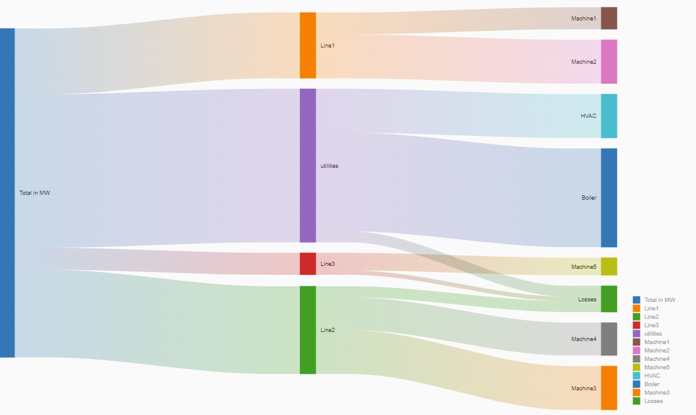
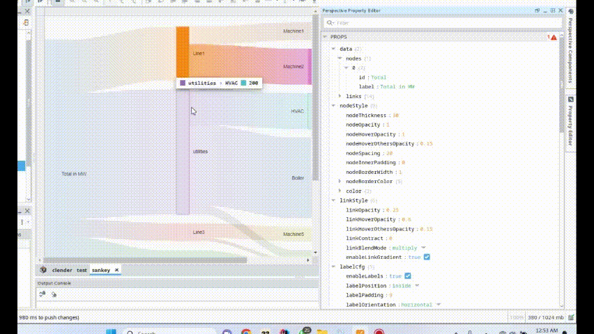

# Nivo Chart Component

The Nivo Chart component allows you to create Sankey charts and GitHub calendars in Ignition. This document provides details on how to configure and use this component.

## Sankey Chart

The Sankey Chart is a visual representation of the flow and distribution of resources, values, or quantities between multiple entities or components.

### Properties

#### `data` (Object)

- `links` (Array of Objects)
  - `source` (String): Refers to the connection's origin.
  - `target` (String): Points to the connection's destination.
  - `value` (Number): Represents the connection value.
  - `tooltipEmbeddedView` (Object): Main properties in a normal EmbeddedView that you can attach to the link (activated when 'interactivity.customLinkTooltip' is set to true).

- `nodes` (Array of Objects) [Optional]
  - `id` (String): ID of the node which you want to link.
  - `nodeColor` (String): Custom color for the node (activated when 'nodeStyle.color.customNodeColor' is set to true).
  - `nodeBorderColor` (String): Custom border color for the node (activated when 'nodeStyle.nodeBorderColor.customNodeBorderColor' is set to true).
  - `tooltipEmbeddedView` (Object): Properties in a normal EmbeddedView that you can attach to the node (activated when 'interactivity.customNodeTooltip' is set to true).
  - `label` (String) [Optional]: Optional property to display on the chart and legend. Set to 'false' to display the 'id' instead.

#### `nodeStyle` (Object)

- `nodeThickness` (Number): Thickness of the nodes (default: 30).
- `nodeOpacity` (Number): Opacity of the nodes (0~1) (default: 1).
- `nodeHoverOpacity` (Number): Opacity of the nodes on hover (0~1) (default: 1).
- `nodeHoverOthersOpacity` (Number): Opacity of other nodes on hover (0~1) (default: 0.15).
- `nodeSpacing` (Number): Spacing between nodes at the same level (default: 20).
- `nodeInnerPadding` (Number): Inner padding of nodes, the distance from links, subtracted from nodeThickness (default: 0).
- `nodeBorderWidth` (Number): Width of the node border (default: 1).
- `nodeBorderColor` (Object):
  - `customNodeBorderColor` (Boolean): If true, custom node border color is activated (default: false).
  - `nodeBorderColorMode` (Enum: "inherit", "singleBorderColor"): Method to compute node border color (default: "inherit").
  - `modifiers` (String, Enum: "brighter", "darker", "opacity"): Type of modifier for node border color (default: "opacity").
  - `value` (Number): Value to apply to the modifiers (0~3).
  - `color` (String, Format: Color): Color of the node border.

- `color` (Object):
  - `customNodeColor` (Boolean): If true, the node color property in the data will be activated.
  - `colorScheme` (See [here](https://nivo.rocks/guides/colors/)).

#### `linkStyle` (Object)

- `linkOpacity` (Number): Link opacity (0~1) (default: 0.25).
- `linkHoverOpacity` (Number): Link opacity on hover (0~1) (default: 0.6).
- `linkHoverOthersOpacity` (Number): Other links opacity on hover (0~1) (default: 0.15).
- `linkContract` (Number): Determines the contract width of the links (default: 0).
- `linkBlendMode` (String, Enum: "normal", "multiply", ...): Define CSS mix-blend-mode for links (default: "multiply").
  - More info: [MDN Documentation](https://developer.mozilla.org/fr/docs/Web/CSS/mix-blend-mode)
- `enableLinkGradient` (Boolean): Enable/disable gradient from source/target nodes instead of plain color.

#### `labelCfg` (Object)

- `enableLabels` (Boolean): Enable or disable the display of labels (default: true).
- `labelPosition` (Enum: "inside", "outside"): Position of labels (default: "inside").
- `labelPadding` (Number): Padding distance of labels from the nodes (default: 9).
- `labelOrientation` (Enum: "horizontal", "vertical"): Orientation of labels (default: "horizontal").
- `labelTextColor` (Object):
  - `labelTextColorMode` (Enum: "inherit", "custom"): Method to compute the label text color (default: "inherit").
  - `modifiers` (Enum: "brighter", "darker", "opacity"): Adjust text color (default: "darker").
  - `value` (Number): Numeric value within a range of 0 to 3 (default: 1.5).
  - `color` (String, Format: Color): Custom color for label text.

### Interactivity

#### `customNodeTooltip` (Boolean)

When enabled, custom node tooltips are used.

- `commonNodeTooltipFormat` (String): Format for node tooltips (applicable when "customNodeTooltip" is true). Available variables: {node.id}, {node.value}.

#### `customLinkTooltip` (Boolean)

When enabled, custom link tooltips are used.

- `commonLinkTooltipFormat` (String): Format for link tooltips (applicable when "customLinkTooltip" is true). Available variables: {link.sourceId}, {link.targetId}, {link.value}, {link.sourceValue}, {link.targetValue}.

#### `isInteractive` (Boolean)

Determines whether interactivity is enabled for the chart (default: true).

## Events

- `onLinkClicked` (Function):
  Returns an object with the following properties:
  - `sourceId` (String)
  - `sourceValue` (Number)
  - `targetId` (String)
  - `targetValue` (String)
  - `linkValue` (Number)

- `onNodeClicked` (Function):
  Returns an object with the following properties:
  - `nodeId` (String)
  - `nodeValue` (Number)
  - `totalOut` (Number)
  - `totalIn` (Number)
  - `outInfo` (Array of Objects) (Each object contains `id` and `value` properties)
  - `intoInfo` (Array of Objects) (Each object contains `id` and `value` properties)

## Legends

For information on customizing legends, see the [Nivo Chart Legends Guide](https://nivo.rocks/guides/legends/).
